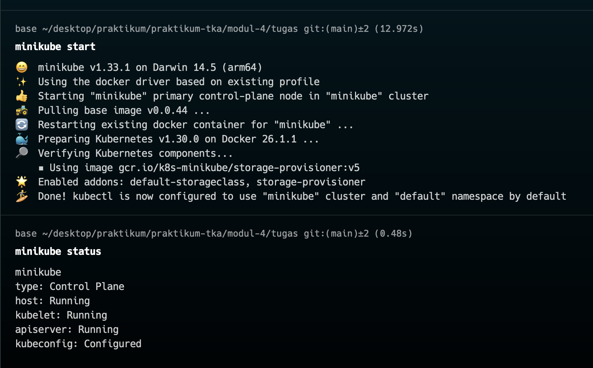

Tugas TKA
struktur repo:

buka aplikasi docker kemudian
Start minikube terlebih dahulu:

Bulid image:

Mengcreate deploy:


mengecek apakah sudah running semua:


buat port forwarding bebas:
Post forward 8081(nginx):

hasil:

Port-forward 5000(flask):

hasil:

port-forward : 8081(apache):
≤2 .png>)
hasil:

